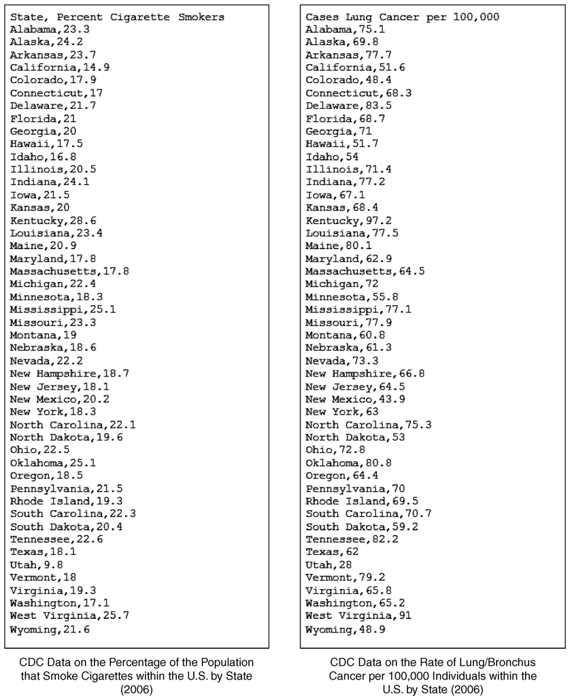

# smoke_v_cancer.py - Cigarette Use/Lung Cancer Correlation Program 
Using data from <mark>Centers for Disease Control and Prevention (CDC)</mark>,
the program computes the correlation between cigarette use and indices of lung
cancer. 
The computed correlation, along with other factors, can be used to determined 
if there is a causal relationship between the two.

Data Set
=======================
One data set gives the percentage of the population that smoke cigarettes 
within the United States by state. The other gives the rate of lung cancer 
per 100,000 individuals by state. 

 
 

Usage
=====
Run:
<pre>
$ <kbd>python3 smoke_v_cancer.py</kbd>
</pre>

Pseudocode Reference
====================

Attribution
===========
“Introduction to Computer Science Using Python: A Computational 
Problem-Solving Focus”, Charles Dierbach, John Wiley, 2012.

[See the Book](http://eu.wiley.com/WileyCDA/Section/id-302479.html?query=Charles+Dierbach)

